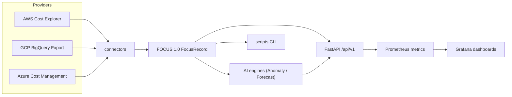
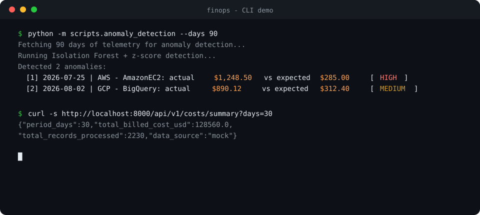

# Multi-Cloud FinOps Platform (Community Edition)

[](LICENSE)
[](.github/workflows/ci.yml)
[](https://aws.amazon.com/)
[](https://cloud.google.com/)
[](https://azure.microsoft.com/)
[](https://fastapi.tiangolo.com/)
[](https://www.python.org/)
[](https://www.docker.com/)
[](https://www.terraform.io/)
[](https://prometheus.io/)
[](https://grafana.com/)
[](https://kubernetes.io/)

Open-core cost aggregation, FOCUS 1.0 normalization, ML anomaly detection, forecasting, and Prometheus monitoring across AWS, GCP, and Azure. 

## Table of contents

- [What it does](#what-it-does)
- [Architecture](#architecture)
- [Demo](#demo)
- [Quick start](#quick-start)
- [Project structure](#project-structure)
- [API](#api)
- [CLI tooling](#cli-tooling)
- [Monitoring](#monitoring)
- [Infrastructure](#infrastructure)
- [Kubernetes](#kubernetes)
- [Tests](#tests)
- [Tech stack](#tech-stack)
- [Enterprise Edition & Sponsorship](#enterprise-edition--sponsorship)
- [Contributing](#contributing)
- [License](#license)

## What it does

| Capability | Community Edition (Free) | Enterprise Edition (Proprietary) |
|---|:---:|:---:|
| **Multi-Cloud FOCUS 1.0 Normalization** | ✅ Included | ✅ Included |
| **AWS / GCP / Azure Connectors** | ✅ Included | ✅ Included + Multi-Account / Org Aggregation |
| **ML Anomaly Detection (Isolation Forest)** | ✅ Included | ✅ Included |
| **Cost Forecasting (95% CI Bounds)** | ✅ Included | ✅ Included |
| **Prometheus Exporter & Grafana Dashboards** | ✅ Included | ✅ Included + Enterprise Dashboards |
| **KEDA Kubernetes Autoscaler** | ✅ Included | ✅ Included |
| **Zero-Config Zombie Spend Detection** | 🔒 *Enterprise Only* | ✅ **Included (Agentless FOCUS correlation)** |
| **Change Intelligence & Deploy Attribution** | 🔒 *Enterprise Only* | ✅ **Included (Git diffs, SHAs, authors)** |
| **Automated Rightsizing & Waste Elimination** | 🔒 *Enterprise Only* | ✅ **Included (Compute, Spot, Commitments)** |
| **Live CloudWatch / GCP / Azure Audit Logs** | 🔒 *Enterprise Only* | ✅ **Included (Continuous real-time telemetry)** |

## Architecture



## Demo



## Quick start

### Docker stack

```bash
git clone https://github.com/priyaranjan-sahu/multi-cloud-finops.git
cd multi-cloud-finops
cp .env.example .env
# Edit .env and set a non-default Grafana password.
docker compose up --build
```

| Service | URL |
|---|---|
| API + Swagger docs | http://localhost:8000/docs |
| Prometheus metrics | http://localhost:8000/metrics |
| Grafana dashboards | http://localhost:3000 (credentials from `.env`) |

### Local development

```bash
git clone https://github.com/priyaranjan-sahu/multi-cloud-finops.git
cd multi-cloud-finops
pip install -r requirements-dev.txt
uvicorn finops_engine.api.app:app --host 0.0.0.0 --port 8000 --reload
```

### Configuration

Runtime behavior is controlled by environment variables:

| Variable | Default | Description |
|---|---|---|
| `FINOP_MOCK_MODE` | `false` | Use synthetic telemetry; `.env.example` enables it only for local demos |
| `FINOP_ALLOW_MOCK_FALLBACK` | `false` | Fall back to synthetic data when live fetch returns nothing |
| `FINOP_API_KEY` | *(empty)* | When set, all `/api/*` routes require an `X-API-Key` header |
| `FINOP_CORS_ORIGINS` | *(empty = allow all)* | Comma-separated origin allow-list for CORS |
| `FINOP_METRICS_REFRESH_SECONDS` | `15` | How often Prometheus metrics are recomputed |
| `LOG_LEVEL` | `INFO` | Logging verbosity |

For live mode, configure at least one provider using `FINOP_AWS_ACCOUNT_ID` (plus `FINOP_AWS_REGION`), both `FINOP_GCP_PROJECT_ID` and `FINOP_GCP_BILLING_TABLE`, or `FINOP_AZURE_SUBSCRIPTION_ID`; credentials come from the standard cloud SDK chain. Live mode is fail-closed: if no configured provider returns data and `FINOP_ALLOW_MOCK_FALLBACK` is off, the API returns `503` rather than reporting synthetic data as real. The service currently accepts USD billing records only.

## Project structure

```
multi-cloud-finops/
├── docker-compose.yml              # Full monitoring stack
├── Dockerfile                      # Multi-stage non-root build
├── Makefile                        # Common dev/CI targets
├── pyproject.toml                  # Project metadata, lint & test config
├── requirements.txt                # Pinned dependencies
├── requirements-dev.txt            # Development & CI dependencies
├── CHANGELOG.md
├── CONTRIBUTING.md
├── LICENSE
├── SECURITY.md
├── social-preview.jpg              # Repository social preview image
├── assets/
│   └── terminal-demo.svg           # README demo image
│
├── finops_engine/                  # Core open-source package
│   ├── config.py                   # Env-driven settings
│   ├── errors.py                   # Domain exceptions
│   ├── schema/
│   │   └── focus_spec.py           # FOCUS 1.0 FocusRecord model + normalization
│   ├── connectors/
│   │   ├── aws_connector.py        # AWS Cost Explorer (boto3)
│   │   ├── gcp_connector.py        # GCP BigQuery billing export
│   │   ├── azure_connector.py      # Azure Cost Management query API
│   │   ├── mock_connector.py       # Deterministic synthetic telemetry
│   │   └── __init__.py             # Fail-closed multi-provider gateway
│   ├── ai/
│   │   ├── anomaly_detector.py     # IsolationForest + z-score
│   │   └── cost_forecaster.py      # Linear regression + prediction intervals
│   ├── exporter/
│   │   └── metrics_exporter.py     # Background Prometheus exporter
│   └── api/
│       ├── app.py                  # FastAPI application
│       └── models.py               # Response models for OpenAPI
│
├── scripts/                        # CLI tools (python -m scripts.<tool>)
│   ├── anomaly_detection.py
│   └── cost_forecasting.py
│
├── src/
│   └── main.py                     # Entry point (uvicorn)
│
├── infra/                          # Terraform (parameterized, no secrets)
├── kubernetes/                     # Deployment + KEDA autoscaling manifests
├── monitoring/                     # Prometheus config, Grafana dashboard
└── tests/
```

## API

Interactive docs are served at `/docs`. Every response includes a `data_source` field (`mock` / `live` / `mock-fallback`). Routes under `/api/*` require an `X-API-Key` header when `FINOP_API_KEY` is set.

| Method | Endpoint | Description |
|---|---|---|
| `GET` | `/` | Health check and service info |
| `GET` | `/api/v1/costs/summary` | Aggregated spend by provider, service, region |
| `GET` | `/api/v1/costs/focus-export` | FOCUS 1.0 telemetry export (paginated via `limit`/`offset`) |
| `GET` | `/api/v1/anomalies/detect` | Anomaly detection with severity and baseline deviation |
| `GET` | `/api/v1/forecast/predict` | Spend projection with confidence bounds |
| `GET` | `/metrics` | Prometheus scrape endpoint |

### Example: anomaly detection

```json
{
  "analyzed_days": 60,
  "anomalies_detected_count": 3,
  "anomalies": [
    {
      "date": "2024-02-14",
      "provider": "AWS",
      "service": "AmazonEC2",
      "actual_cost_usd": 1248.50,
      "expected_baseline_usd": 285.00,
      "anomaly_excess_usd": 963.50,
      "z_score": 5.82,
      "severity": "HIGH",
      "root_cause": "AWS AmazonEC2 spent $963.5 above baseline"
    }
  ]
}
```

## CLI tooling

```bash
python -m scripts.anomaly_detection --days 90
python -m scripts.cost_forecasting --history-days 180 --forecast-days 90
```

## Monitoring

Metrics exported to Prometheus:

| Metric | Labels |
|---|---|
| `finops_cloud_cost_usd` | `provider`, `service` |
| `finops_anomalies_active_count` | `severity` |
| `finops_api_requests_total` | `endpoint` |

The Grafana dashboard includes panels for total spend, active anomalies, and spend distribution by provider/service.

## Infrastructure

Terraform modules live in `infra/`. Copy `terraform.tfvars.example` to `terraform.tfvars`, fill in subnet IDs, launch templates, and bucket names, then run `./deploy.sh` (plan-gated) or `./destroy.sh` (confirm-gated).

## Kubernetes

```bash
cp kubernetes/finops-runtime-config.example.yaml kubernetes/finops-runtime-config.yaml
# Replace every placeholder, then create the Secret outside source control.
kubectl apply -f kubernetes/finops-runtime-config.yaml
kubectl apply -f kubernetes/deployment.yaml
kubectl apply -f kubernetes/keda_autoscaler.yaml
```
Replace `ghcr.io/your-org/multi-cloud-finops:1.3.0` with your published immutable image tag before applying the deployment.

The KEDA ScaledObject scales the deployment between 1-15 replicas based on CPU (70%) and memory (80%) utilization thresholds.

## Tests

```bash
pip install -r requirements-dev.txt
make check              # lint + format check + typecheck + tests
```

Individual targets: `make lint`, `make typecheck`, `make test`, `make cov`.
See `CONTRIBUTING.md` for the full workflow.

## Tech stack

| Layer | Technology |
|---|---|
| Language | Python 3.10+ |
| API | FastAPI + Uvicorn |
| Data schema | FOCUS 1.0 + Pydantic v2 |
| ML | scikit-learn, NumPy, Pandas |
| Cloud SDKs | boto3, google-cloud-bigquery, azure-mgmt-costmanagement |
| Metrics | Prometheus client |
| Infrastructure | Terraform (AWS / GCP / Azure) |
| Orchestration | Kubernetes + KEDA |
| Containerization | Docker + Docker Compose |

---

## Enterprise Edition & Sponsorship

For high-scale cloud footprints requiring automated waste eradication and deployment tracking, the proprietary **Enterprise Edition** includes:

* **Zero-Config Zombie Spend Detection:** Agentless cross-correlation of FOCUS telemetry to find provisioned resources with zero activity metrics (idle NAT gateways, orphaned LBs, warm containers, idle databases).
* **Change Intelligence & Deployment Attribution:** Directly links billing baseline shifts to Git commit SHAs, authors, and configuration diffs (e.g. `min-instances: 0 -> 1`).
* **Automated Rightsizing & Waste Analysis:** Multi-cloud compute downscaling, spot migration recommendations, and commitment coverage optimization.
* **Continuous Cloud Audit Connectors:** Deep integration with live CloudWatch, GCP Monitoring, and Azure Monitor metrics.

[](https://github.com/sponsors/priyaranjan-sahu)

### Sponsorship & Access Tiers

* **☕ $10 / month (Supporter):** Recognition in our contributors list and official sponsor badge.
* **🚀 $39 / month (Pro Individual):** Pull access to pre-built compiled Enterprise Docker images (`ghcr.io/...`), CLI tools, and private Discord support.
* **💼 $99 / month (Team):** Full enterprise container access for your team, custom onboarding video support, and 24h SLA.
* **🏢 $299 / month (Enterprise):** Monthly 1-on-1 architecture review calls, direct input on roadmap, and 4h SLA.

---

## Contributing

See `CONTRIBUTING.md` for the development workflow and conventions. Pull requests are welcome; for larger changes, open an issue first.

## Ecosystem & Companion Tools

For operational and security audit capabilities that complement this FinOps engine, check out:
- **[Multi-Cloud Automation Scripts](https://github.com/priyaranjan-sahu/multi-cloud-automation-scripts)**: Audit scripts (PowerShell, Bash, Python) designed to scan storage exposure, verify private endpoint configurations, and run compliance checks across AWS, Azure, and GCP.

## License & Intellectual Property

* **Community Edition:** Distributed under the [MIT License](./LICENSE). Copyright (c) 2026 Priya Ranjan Sahu.
* **Enterprise Edition:** Proprietary & Confidential. Access granted via [GitHub Sponsors](https://github.com/sponsors/priyaranjan-sahu) or commercial enterprise license agreements.
