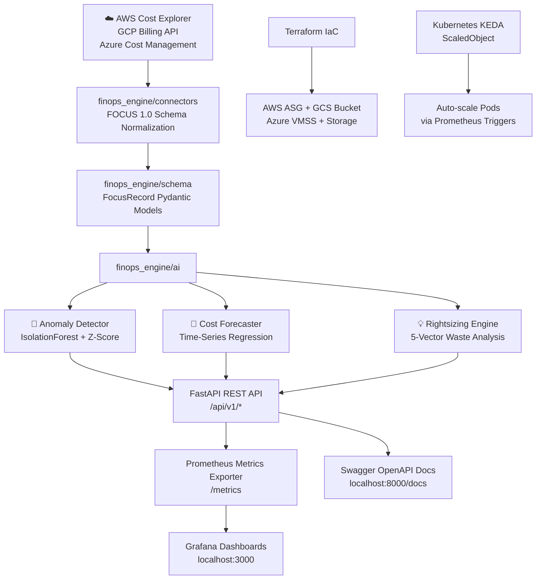

# 🌍 Multi-Cloud FinOps & Cost Optimization Platform

<div align="center">


**Production-grade, AI-powered multi-cloud cost intelligence platform built to FOCUS 1.0 standards.**  
Detect cost anomalies, forecast spend, automate rightsizing, and scale Kubernetes workloads — across AWS, GCP, and Azure.

[📖 API Docs](#-api-reference) • [🚀 Quick Start](#-quick-start) • [🏗 Architecture](#-system-architecture) • [🤖 AI Engines](#-ai--ml-engines) • [📊 Monitoring](#-monitoring--observability)

</div>

---

## 🎯 What This Platform Does

| Capability | Description |
|---|---|
| 🔍 **Real-Time Cost Monitoring** | Aggregated multi-cloud spend visibility across AWS, GCP & Azure using FOCUS 1.0 standard |
| 🚨 **AI Anomaly Detection** | Dual-engine (IsolationForest + Z-Score) with root-cause attribution and severity classification |
| 🔮 **Cost Forecasting** | 30/60/90-day time-series projections with 95% confidence intervals |
| 💡 **Rightsizing Engine** | Scans 5 waste vectors (Idle VMs, Unattached Storage, Unused IPs, K8s over-allocation, RI gaps) |
| ⚡ **Spot Instance Optimization** | AWS/GCP/Azure compute cost reduction via preemptible/spot workload migration |
| 📈 **Prometheus + Grafana** | Production metrics exporter with multi-panel Grafana cost intelligence dashboards |
| 🏗 **Infrastructure as Code** | Terraform modules for multi-cloud auto-scaling groups and FinOps log storage |
| ☸️ **KEDA Autoscaling** | Kubernetes event-driven scaling driven by Prometheus CPU and memory metrics |

---

## 🏗 System Architecture



---

## 🚀 Quick Start

### Option 1: 1-Click Docker Stack (Recommended)

```bash
git clone https://github.com/priyaranjan-sahu/multi-cloud-finops.git
cd multi-cloud-finops
docker-compose up --build
```

| Service | URL |
|---|---|
| FinOps API + Swagger Docs | http://localhost:8000/docs |
| Prometheus Metrics | http://localhost:8000/metrics |
| Grafana Dashboards | http://localhost:3000 (admin/admin) |

### Option 2: Local Development

```bash
git clone https://github.com/priyaranjan-sahu/multi-cloud-finops.git
cd multi-cloud-finops
pip install -r requirements.txt
uvicorn finops_engine.api.app:app --host 0.0.0.0 --port 8000 --reload
```

---

## 🧩 Project Structure

```
multi-cloud-finops/
├── docker-compose.yml              # 1-click production stack
├── Dockerfile                      # Multi-stage container build
├── pytest.ini                      # Test runner configuration
├── requirements.txt                # Python dependencies
│
├── finops_engine/                  # Core Engine Package
│   ├── schema/
│   │   └── focus_spec.py           # FOCUS 1.0 FocusRecord Pydantic models
│   ├── connectors/
│   │   ├── aws_connector.py        # AWS Cost Explorer (boto3)
│   │   ├── gcp_connector.py        # GCP Cloud Billing API
│   │   ├── azure_connector.py      # Azure Cost Management SDK
│   │   └── mock_connector.py       # Realistic 90-day telemetry generator
│   ├── ai/
│   │   ├── anomaly_detector.py     # IsolationForest + Z-Score engine
│   │   ├── cost_forecaster.py      # Time-series regression model
│   │   └── rightsizing_engine.py   # 5-vector waste analysis
│   ├── exporter/
│   │   └── metrics_exporter.py     # Prometheus custom metrics exporter
│   └── api/
│       └── app.py                  # FastAPI REST application server
│
├── src/
│   ├── main.py                     # Application entrypoint
│   ├── cost_apis.py                # Multi-cloud API gateway wrappers
│   ├── ai_anomaly_detection.py     # Standalone anomaly detection script
│   └── ai_cost_prediction.py       # Standalone cost forecasting script
│
├── optimization/
│   ├── rightsizing_recommendations.py  # CLI rightsizing runner
│   └── spot_instance_optimization.py   # Spot/preemptible analytics
│
├── automation/
│   ├── rightsizing_recommendations.py  # Export recommendations to JSON
│   └── spot_instance_optimization.py   # Automated spot provisioning
│
├── infra/
│   ├── terraform.tf                # Multi-cloud storage infrastructure
│   ├── terraform_autoscale.tf      # Auto-scaling group definitions
│   ├── deploy.sh                   # Terraform deploy script
│   └── destroy.sh                  # Terraform teardown script
│
├── kubernetes/
│   └── keda_autoscaler.yaml        # KEDA ScaledObject (CPU + Memory triggers)
│
├── monitoring/
│   ├── prometheus.yml              # Prometheus scrape configuration
│   ├── grafana_dashboard.json      # Multi-panel cost intelligence dashboard
│   └── grafana_setup.sh            # Grafana installation script
│
└── tests/
    ├── test_focus_spec.py          # FOCUS 1.0 schema unit tests
    ├── test_ai_engines.py          # Anomaly, forecast & rightsizing tests
    └── test_api.py                 # FastAPI endpoint integration tests
```

---

## 📡 API Reference

All endpoints are available via interactive OpenAPI docs at `http://localhost:8000/docs`.

| Method | Endpoint | Description |
|---|---|---|
| `GET` | `/` | Platform health check & system info |
| `GET` | `/api/v1/costs/summary` | Multi-cloud aggregated spend summary |
| `GET` | `/api/v1/costs/focus-export` | FOCUS 1.0 standardized telemetry export |
| `GET` | `/api/v1/anomalies/detect` | AI cost anomaly detection with root cause |
| `GET` | `/api/v1/forecast/predict` | 30/60/90-day cost projection with confidence intervals |
| `GET` | `/api/v1/recommendations/rightsizing` | Rightsizing actions with monthly ROI |
| `GET` | `/metrics` | Prometheus metrics scrape endpoint |

### Example — Anomaly Detection Response

```json
{
  "analyzed_days": 60,
  "anomalies_detected_count": 3,
  "anomalies": [
    {
      "date": "2024-02-14",
      "provider": "AWS",
      "service": "AmazonEC2",
      "actual_cost_usd": 1248.50,
      "expected_baseline_usd": 285.00,
      "anomaly_excess_usd": 963.50,
      "z_score": 5.82,
      "severity": "HIGH",
      "root_cause": "Unusual spend spike detected in AWS service AmazonEC2 ($963.50 above baseline)"
    }
  ]
}
```

---

## 🤖 AI / ML Engines

### Anomaly Detector
- **Algorithm**: Dual-engine approach combining `sklearn IsolationForest` with adaptive rolling Z-Score thresholding.
- **Input**: 60–180 days of FOCUS 1.0 multi-cloud telemetry.
- **Output**: Per-provider, per-service anomalies with severity (`HIGH / MEDIUM / LOW`), baseline deviation, Z-Score, and root cause narrative.

### Cost Forecaster
- **Algorithm**: Time-series `LinearRegression` with residual-based 95% confidence interval estimation.
- **Input**: Historical daily spend per provider.
- **Output**: 30/60/90-day daily predictions with upper and lower confidence bounds.

### Rightsizing Engine
- **Waste Vectors Detected**: Oversized EC2/VM instances, unattached volumes, unused IPs, K8s pod over-allocation, RI/Savings Plan coverage gaps.
- **Output**: Ranked recommendations with current monthly cost, projected cost, and estimated monthly savings in USD.

---

## 📊 Monitoring & Observability

### Prometheus Metrics

| Metric | Labels | Description |
|---|---|---|
| `finops_cloud_cost_usd` | `provider`, `service` | Real-time cloud cost per provider/service |
| `finops_anomalies_active_count` | `severity` | Active anomaly count by severity |
| `finops_potential_savings_usd` | `provider`, `category` | Potential savings by waste vector |
| `finops_api_requests_total` | `endpoint` | API request counter per endpoint |

### Grafana Dashboard Panels
- **Total Multi-Cloud Spend** (Stat Panel with threshold coloring)
- **Active Cost Anomalies** (Stat Panel with alert-level coloring)
- **Potential Monthly Savings Identified** (ROI counter)
- **Cloud Spend Distribution** (Time-series by Provider & Service)
- **Waste Savings Breakdown** (Bar Gauge by Category)

---

## 🏗 Infrastructure (Terraform)

```bash
cd infra/
terraform init
./deploy.sh         # Provision all multi-cloud storage & autoscaling resources
./destroy.sh        # Tear down all provisioned resources
```

### Resources Provisioned
| Cloud | Resource |
|---|---|
| AWS | `aws_s3_bucket` (encrypted), `aws_autoscaling_group` (Spot-mixed policy) |
| GCP | `google_storage_bucket`, `google_compute_instance_group_manager` |
| Azure | `azurerm_resource_group`, `azurerm_storage_account`, `azurerm_virtual_machine_scale_set` |

---

## ☸️ Kubernetes KEDA Autoscaling

```bash
kubectl apply -f kubernetes/keda_autoscaler.yaml
```

Scales `multi-cloud-finops-app` Deployment pods between **1–15 replicas** based on:
- 🔥 CPU utilization threshold: `70%`
- 🧠 Memory working set threshold: `80%`

---

## 🧪 Running Tests

```bash
pip install -r requirements.txt
pytest tests/ -v
```

### Test Coverage
| Test File | Scope |
|---|---|
| `test_focus_spec.py` | FOCUS 1.0 schema creation & normalization |
| `test_ai_engines.py` | Anomaly detection, cost forecasting, rightsizing |
| `test_api.py` | All FastAPI endpoint responses and data structures |

---

## 🛠 Tech Stack

| Layer | Technology |
|---|---|
| Language | Python 3.10+ |
| API Framework | FastAPI + Uvicorn |
| Data Schema | FOCUS 1.0 + Pydantic v2 |
| ML / AI | scikit-learn (IsolationForest, LinearRegression), NumPy, Pandas |
| Cloud SDKs | boto3 (AWS), google-cloud-billing (GCP), azure-mgmt-costmanagement (Azure) |
| Metrics | Prometheus Client |
| Observability | Grafana + Prometheus |
| Infrastructure | Terraform (AWS / GCP / Azure) |
| Orchestration | Kubernetes + KEDA |
| Containerization | Docker + Docker Compose |
| Testing | pytest + httpx |

---

## 🤝 Contributing

Pull requests are welcome. For major changes, please open an issue first to discuss the proposed changes.

```bash
git checkout -b feature/your-feature
git commit -m "feat: your feature description"
git push origin feature/your-feature
```

---

## 📜 License

MIT License — see [LICENSE](./LICENSE) for full details.

---

<div align="center">
  Built with precision for enterprise-grade multi-cloud cost intelligence.
</div>
