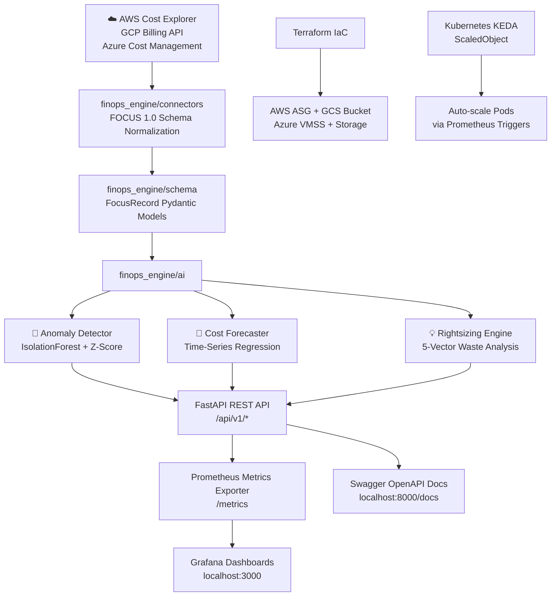

# 🌍 Multi-Cloud FinOps & Cost Optimization Platform

<div align="center">


**Production-grade, AI-powered multi-cloud cost intelligence platform built to FOCUS 1.0 standards.**  
Detect cost anomalies, forecast spend, automate rightsizing, and scale Kubernetes workloads — across AWS, GCP, and Azure.

[📖 API Docs](#-api-reference) • [🚀 Quick Start](#-quick-start) • [🏗 Architecture](#-system-architecture) • [🤖 AI Engines](#-ai--ml-engines) • [📊 Monitoring](#-monitoring--observability)

</div>

---

## 🎯 What This Platform Does

| Capability | Description |
|---|---|
| 🔍 **Real-Time Cost Monitoring** | Aggregated multi-cloud spend visibility across AWS, GCP & Azure using the FOCUS 1.0 schema |
| 🚨 **AI Anomaly Detection** | Dual-engine (IsolationForest + Z-Score) with root-cause attribution and severity classification |
| 🔮 **Cost Forecasting** | 30/60/90-day time-series projections with 95% confidence intervals |
| 💡 **Rightsizing Engine** | Data-driven waste analysis across 5 vectors (Idle Storage, Oversized Compute, Spot-eligible Workloads, K8s Over-allocation, Commitment Gaps) |
| ⚡ **Spot Instance Optimization** | AWS/GCP/Azure compute cost reduction via preemptible/spot workload migration |
| 📈 **Prometheus + Grafana** | Background metrics exporter with auto-provisioned multi-panel Grafana cost dashboards |
| 🏗 **Infrastructure as Code** | Terraform modules for multi-cloud auto-scaling groups and FinOps log storage |
| ☸️ **KEDA Autoscaling** | Kubernetes event-driven scaling driven by true CPU/memory utilization ratios |

---

## 🏗 System Architecture



---

## 🚀 Quick Start

### Option 1: 1-Click Docker Stack (Recommended)

```bash
git clone https://github.com/priyaranjan-sahu/multi-cloud-finops.git
cd multi-cloud-finops
docker-compose up --build
```

| Service | URL |
|---|---|
| FinOps API + Swagger Docs | http://localhost:8000/docs |
| Prometheus Metrics | http://localhost:8000/metrics |
| Grafana Dashboards | http://localhost:3000 (admin/admin) |

### Option 2: Local Development

```bash
git clone https://github.com/priyaranjan-sahu/multi-cloud-finops.git
cd multi-cloud-finops
pip install -r requirements-dev.txt
uvicorn finops_engine.api.app:app --host 0.0.0.0 --port 8000 --reload
```

### Configuration

All runtime behavior is driven by environment variables (no hardcoded secrets):

| Variable | Default | Description |
|---|---|---|
| `FINOP_MOCK_MODE` | `true` | Use synthetic telemetry instead of live cloud APIs |
| `FINOP_ALLOW_MOCK_FALLBACK` | `false` | Silently fall back to synthetic data when live fetch returns nothing |
| `FINOP_API_KEY` | *(empty)* | When set, all `/api/*` routes require an `X-API-Key` header |
| `FINOP_CORS_ORIGINS` | *(empty = allow all)* | Comma-separated origin allow-list for CORS |
| `FINOP_METRICS_REFRESH_SECONDS` | `15` | How often Prometheus metrics are recomputed |
| `LOG_LEVEL` | `INFO` | Logging verbosity |

> Live mode is **fail-closed**: if every cloud provider returns no data and
> `FINOP_ALLOW_MOCK_FALLBACK` is off, the API responds `503` instead of
> silently reporting synthetic data as real.

---

## 🧩 Project Structure

```
multi-cloud-finops/
├── docker-compose.yml              # 1-click production stack
├── Dockerfile                      # Multi-stage non-root container build
├── pyproject.toml                  # Project metadata, lint & test tooling
├── pytest.ini                      # Test runner configuration
├── requirements.txt                # Pinned Python dependencies
├── requirements-dev.txt            # Development & CI dependencies
│
├── finops_engine/                  # Core Engine Package
│   ├── config.py                   # Environment-driven runtime settings
│   ├── schema/
│   │   └── focus_spec.py           # FOCUS 1.0 FocusRecord Pydantic models
│   ├── connectors/
│   │   ├── aws_connector.py        # AWS Cost Explorer (boto3)
│   │   ├── gcp_connector.py        # GCP BigQuery billing export
│   │   ├── azure_connector.py      # Azure Cost Management query API
│   │   ├── mock_connector.py       # Realistic deterministic telemetry generator
│   │   └── __init__.py             # Fail-closed multi-provider gateway
│   ├── ai/
│   │   ├── anomaly_detector.py     # IsolationForest + Z-Score engine
│   │   ├── cost_forecaster.py      # Time-series regression + prediction intervals
│   │   └── rightsizing_engine.py   # Data-driven 5-vector waste analysis
│   ├── exporter/
│   │   └── metrics_exporter.py     # Background Prometheus metrics exporter
│   └── api/
│       ├── app.py                  # FastAPI REST application server
│       └── models.py               # Typed response models for OpenAPI
│
├── scripts/                        # Consolidated CLI tooling (python -m scripts.<tool>)
│   ├── anomaly_detection.py
│   ├── cost_forecasting.py
│   ├── rightsizing.py
│   ├── spot_optimization.py
│   └── export_recommendations.py
│
├── src/
│   └── main.py                     # Application entrypoint
│
├── infra/
│   ├── terraform.tf                # Multi-cloud storage infrastructure
│   ├── terraform_autoscale.tf      # Auto-scaling group definitions
│   ├── variables.tf                # Parameterized inputs (no hardcoded secrets)
│   ├── terraform.tfvars.example    # Sample variable values
│   ├── deploy.sh                   # Plan-gated Terraform deploy script
│   └── destroy.sh                  # Confirm-gated Terraform teardown script
│
├── kubernetes/
│   ├── deployment.yaml             # Deployment + Service manifests
│   └── keda_autoscaler.yaml        # KEDA ScaledObject (CPU + Memory utilization)
│
├── monitoring/
│   ├── prometheus.yml              # Prometheus scrape configuration
│   ├── grafana_dashboard.json      # Multi-panel cost intelligence dashboard
│   └── grafana/provisioning/       # Auto-provisioned datasource & dashboard
│
├── .github/
│   ├── workflows/ci.yml            # Lint + type-check + test matrix on PRs
│   └── pull_request_template.md
│
└── tests/
    ├── test_focus_spec.py          # FOCUS schema unit tests
    ├── test_ai_engines.py          # Anomaly, forecast & rightsizing tests
    ├── test_connectors.py          # Multi-provider gateway tests
    └── test_api.py                 # FastAPI endpoint integration tests
```

---

## 📡 API Reference

All endpoints are available via interactive OpenAPI docs at `http://localhost:8000/docs`.
Every response is fully typed via Pydantic response models, includes a
`data_source` field (`mock` / `live` / `mock-fallback`), and requires an
`X-API-Key` header when `FINOP_API_KEY` is set.

| Method | Endpoint | Description |
|---|---|---|
| `GET` | `/` | Platform health check & system info |
| `GET` | `/api/v1/costs/summary` | Multi-cloud aggregated spend summary |
| `GET` | `/api/v1/costs/focus-export` | FOCUS 1.0 telemetry export (paginated via `limit`/`offset`) |
| `GET` | `/api/v1/anomalies/detect` | AI cost anomaly detection with root cause |
| `GET` | `/api/v1/forecast/predict` | 30/60/90-day cost projection with confidence intervals |
| `GET` | `/api/v1/recommendations/rightsizing` | Data-driven rightsizing actions with monthly ROI |
| `GET` | `/metrics` | Prometheus metrics scrape endpoint |

### Example — Anomaly Detection Response

```json
{
  "analyzed_days": 60,
  "anomalies_detected_count": 3,
  "anomalies": [
    {
      "date": "2024-02-14",
      "provider": "AWS",
      "service": "AmazonEC2",
      "actual_cost_usd": 1248.50,
      "expected_baseline_usd": 285.00,
      "anomaly_excess_usd": 963.50,
      "z_score": 5.82,
      "severity": "HIGH",
      "root_cause": "Unusual spend spike detected in AWS service AmazonEC2 ($963.50 above baseline)"
    }
  ]
}
```

---

## 🧰 CLI Tooling

Each engine is exposed as a standalone CLI via the `scripts` package:

```bash
python -m scripts.anomaly_detection --days 90
python -m scripts.cost_forecasting --history-days 180 --forecast-days 90
python -m scripts.rightsizing --days 90
python -m scripts.spot_optimization --days 90 --discount-pct 0.65
python -m scripts.export_recommendations --days 90 --output recommendations.json
```

---

## 🤖 AI / ML Engines

### Anomaly Detector
- **Algorithm**: Dual-engine approach combining `sklearn IsolationForest` with adaptive rolling Z-Score thresholding.
- **Input**: 60–180 days of FOCUS 1.0 multi-cloud telemetry.
- **Output**: Per-provider, per-service anomalies with severity (`HIGH / MEDIUM / LOW`), baseline deviation, Z-Score, and root cause narrative.

### Cost Forecaster
- **Algorithm**: Time-series `LinearRegression` with t-distribution based 95% prediction intervals that widen with the forecast horizon.
- **Input**: Historical daily spend per provider.
- **Output**: 30/60/90-day daily predictions with upper and lower confidence bounds.

### Rightsizing Engine
- **Waste Vectors Detected**: Underutilized storage, oversized compute (cost-per-usage outliers), spot/preemptible-eligible workloads, K8s pod over-allocation, and commitment coverage gaps.
- **Input**: Live or mock FOCUS telemetry — every recommendation is derived from the actual records (real resource IDs, real observed spend).
- **Output**: Ranked recommendations with current monthly cost, projected cost, and estimated monthly savings in USD.

---

## 📊 Monitoring & Observability

### Prometheus Metrics

| Metric | Labels | Description |
|---|---|---|
| `finops_cloud_cost_usd` | `provider`, `service` | Real-time cloud cost per provider/service |
| `finops_anomalies_active_count` | `severity` | Active anomaly count by severity |
| `finops_potential_savings_usd` | `provider`, `category` | Potential savings by waste vector |
| `finops_api_requests_total` | `endpoint` | API request counter per endpoint |

### Grafana Dashboard Panels
- **Total Multi-Cloud Spend** (Stat Panel with threshold coloring)
- **Active Cost Anomalies** (Stat Panel with alert-level coloring)
- **Potential Monthly Savings Identified** (ROI counter)
- **Cloud Spend Distribution** (Time-series by Provider & Service)
- **Waste Savings Breakdown** (Bar Gauge by Category)

---

## 🏗 Infrastructure (Terraform)

All values are parameterized through `infra/variables.tf`. Copy
`terraform.tfvars.example` to `terraform.tfvars` and fill in real subnet IDs,
launch templates, and bucket names before applying.

```bash
cd infra/
cp terraform.tfvars.example terraform.tfvars  # fill in your values
./deploy.sh         # plan-gated deployment (per-environment workspaces)
./destroy.sh        # confirm-gated teardown
```

### Resources Provisioned
| Cloud | Resource |
|---|---|
| AWS | `aws_s3_bucket` (encrypted + versioned), `aws_autoscaling_group` (Spot-mixed policy) |
| GCP | `google_storage_bucket` (versioned), `google_compute_instance_group_manager` |
| Azure | `azurerm_resource_group`, `azurerm_storage_account`, `azurerm_virtual_machine_scale_set` (SSH-key auth) |

---

## ☸️ Kubernetes KEDA Autoscaling

```bash
kubectl apply -f kubernetes/deployment.yaml      # Deployment + Services
kubectl apply -f kubernetes/keda_autoscaler.yaml # KEDA ScaledObject
```

Scales `multi-cloud-finops-app` Deployment pods between **1–15 replicas** based on
true utilization ratios (pod usage / pod limits):
- 🔥 CPU utilization threshold: `70%`
- 🧠 Memory working set threshold: `80%`

---

## 🧪 Running Tests

```bash
pip install -r requirements-dev.txt
pytest tests/ -v          # unit + integration
ruff check .              # lint
mypy finops_engine        # type-check
```

### Test Coverage
| Test File | Scope |
|---|---|
| `test_focus_spec.py` | FOCUS schema creation, credits, & normalization |
| `test_ai_engines.py` | Anomaly detection, forecasting, data-driven rightsizing |
| `test_connectors.py` | Fail-closed multi-provider gateway |
| `test_api.py` | Endpoint responses, pagination, auth, and mock gating |

---

## 🛠 Tech Stack

| Layer | Technology |
|---|---|
| Language | Python 3.10+ |
| API Framework | FastAPI + Uvicorn |
| Data Schema | FOCUS 1.0 + Pydantic v2 |
| ML / AI | scikit-learn (IsolationForest, LinearRegression), NumPy, Pandas |
| Cloud SDKs | boto3 (AWS), google-cloud-bigquery (GCP billing export), azure-mgmt-costmanagement (Azure) |
| Metrics | Prometheus Client |
| Observability | Grafana + Prometheus |
| Infrastructure | Terraform (AWS / GCP / Azure) |
| Orchestration | Kubernetes + KEDA |
| Containerization | Docker + Docker Compose |
| Testing | pytest + httpx |

---

## 🤝 Contributing

Pull requests are welcome. For major changes, please open an issue first to discuss the proposed changes.

```bash
git checkout -b feature/your-feature
git commit -m "feat: your feature description"
git push origin feature/your-feature
```

---

## 📜 License

MIT License — see [LICENSE](./LICENSE) for full details.

---

<div align="center">
  Built with precision for enterprise-grade multi-cloud cost intelligence.
</div>
